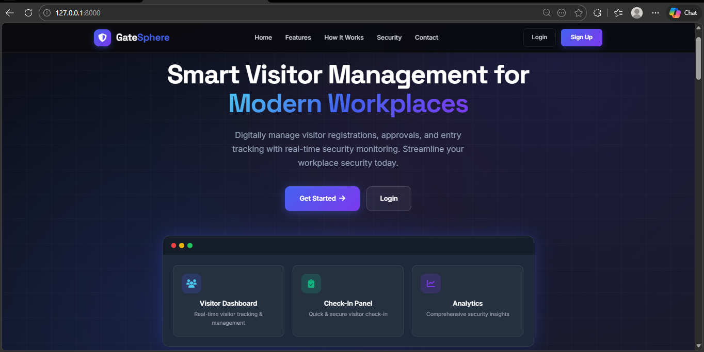
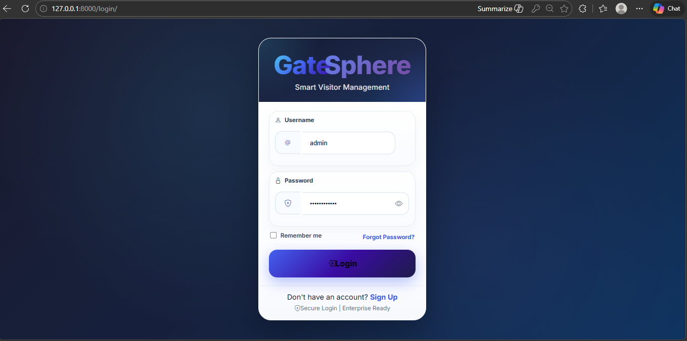
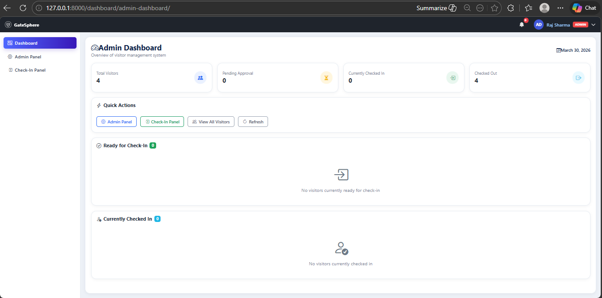
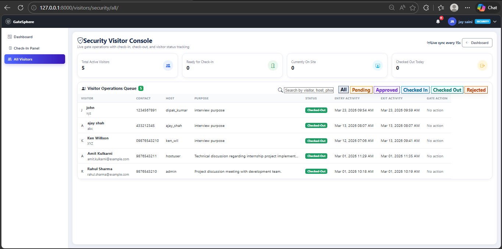
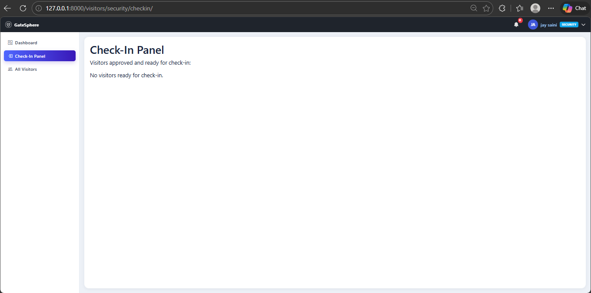

# 🚀 GateSphere – Smart Visitor Management System

GateSphere is a web-based Visitor Management System developed using Django to simplify and digitize the visitor handling process.

It provides a structured and secure way to manage visitor registration, approvals, and real-time check-in/check-out operations. The system supports multiple user roles and ensures smooth coordination between Admin, Host, and Security.

---

## 📌 Project Overview

Managing visitors manually can lead to errors, delays, and security risks. GateSphere solves this problem by providing a centralized and efficient digital solution.

The system enables:
- Easy visitor registration  
- Approval-based access control  
- Real-time visitor tracking  
- Role-based dashboards  

---

## ✨ Key Features

- 🔐 Secure Login & Signup System  
- 👥 Role-Based Access (Admin, Host, Security)  
- 📝 Visitor Registration Module  
- ✅ Approval / Rejection Workflow  
- 🚪 Check-In / Check-Out System  
- 📊 Dynamic Dashboard with Real-Time Data  
- 🔍 Search & Filter Visitors  
- ⚡ Smooth and User-Friendly Interface  

---

## 🧑‍💼 User Roles & Responsibilities

### 👨‍💼 Admin
- Manage users and assign roles  
- Monitor all visitor records  
- View system analytics and reports  

### 🧑‍💼 Host
- Register visitors  
- Approve or reject visitor requests  
- Manage visitor data  

### 🛡️ Security
- Perform visitor check-in  
- Perform visitor check-out  
- Maintain visitor entry logs  

---

## 🔄 Visitor Workflow


Visitor Registration → Approval → Check-In → Check-Out


---

## 🛠️ Technology Stack

| Layer        | Technology |
|-------------|-----------|
| Frontend    | HTML, CSS, Bootstrap, JavaScript |
| Backend     | Python, Django |
| Database    | SQLite |
| Architecture| MVC (Django Framework) |

---

## 📂 Project Structure


GateSphere/
│
├── accounts/ # User authentication & roles
├── visitors/ # Visitor management logic
├── templates/ # HTML templates
├── static/ # CSS, JS, assets
├── db.sqlite3 # Database
├── manage.py # Main entry point
└── README.md


---

## ▶️ How to Run the Project

### 1️⃣ Clone the Repository
```bash
git clone https://github.com/your-username/GateSphere.git
2️⃣ Navigate to Project
cd GateSphere
3️⃣ Install Dependencies
pip install -r requirements.txt
4️⃣ Apply Migrations
python manage.py migrate
5️⃣ Run the Server
python manage.py runserver
6️⃣ Open in Browser
http://127.0.0.1:8000/
## 📷 Screenshots

### 🌐 Landing Page


### 🔐 Login Page


### 📊 Admin Dashboard


### 🛡️ Security Visitor Console


### 🚪 Check-In Panel


🧪 Testing & Validation
Functional testing completed
Role-based workflows verified
Visitor lifecycle tested
20+ test cases executed successfully
🚀 Future Enhancements
📱 QR Code-based Check-In
📧 Email/SMS Notifications
☁️ Cloud Deployment
📊 Advanced Analytics Dashboard
🎯 Project Status

✔ Core modules completed
✔ Fully functional system
✔ Ready for deployment and demonstration

🙏 Acknowledgment

This project was developed as part of an internship at
VS Software Lab, Baramati
